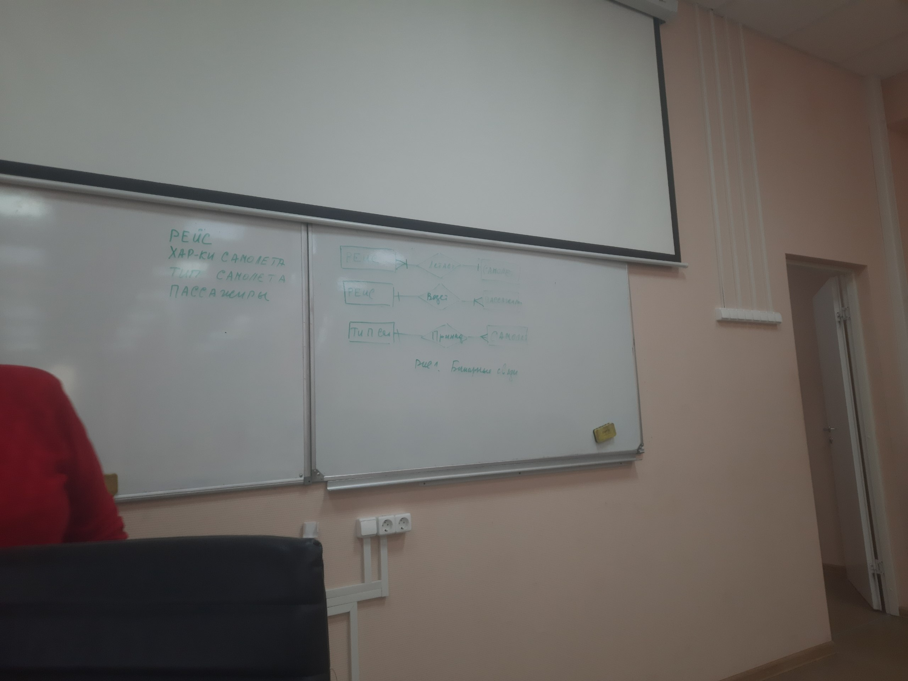
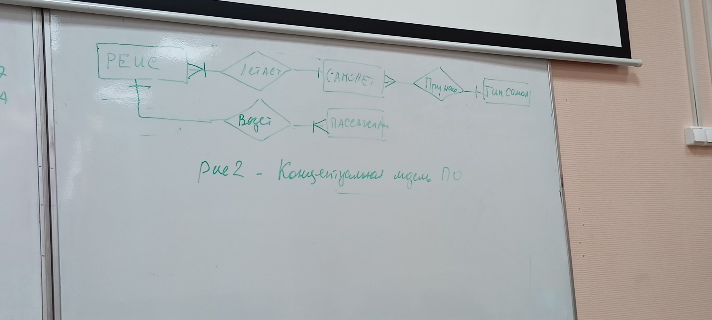
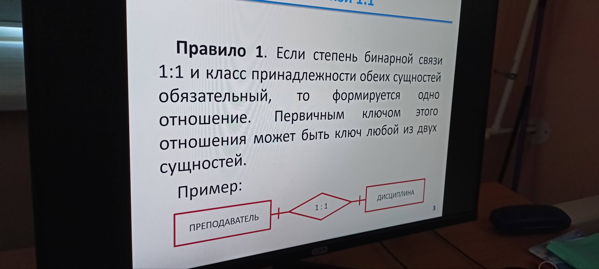
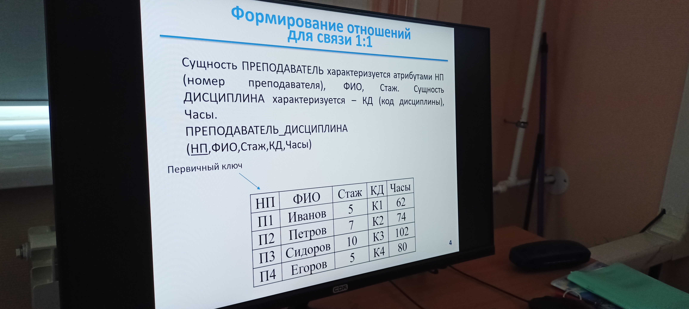
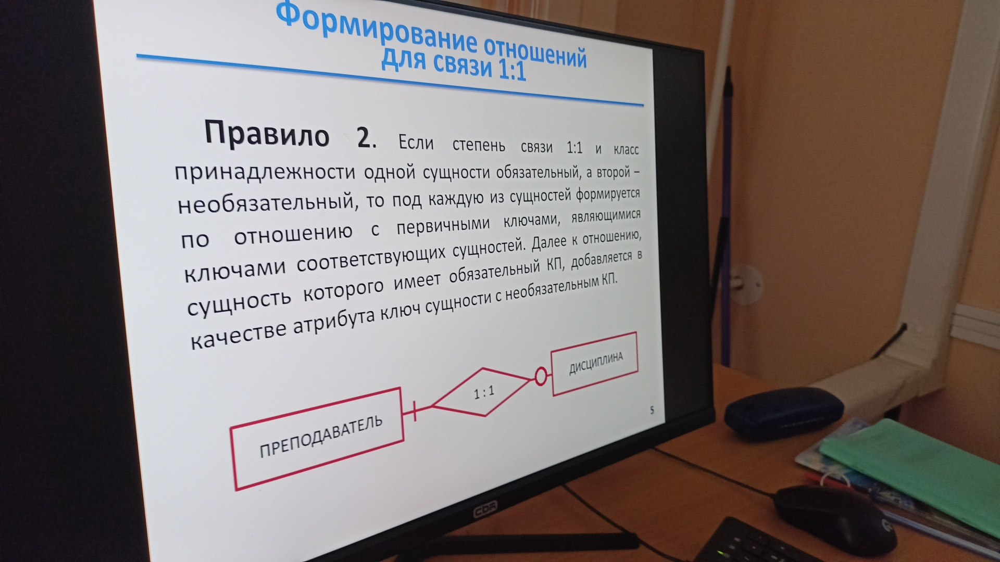
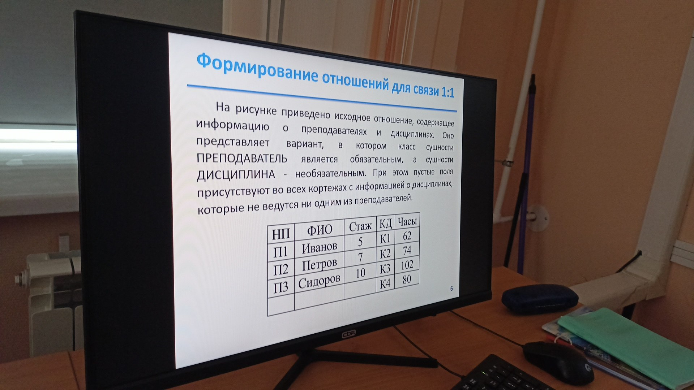
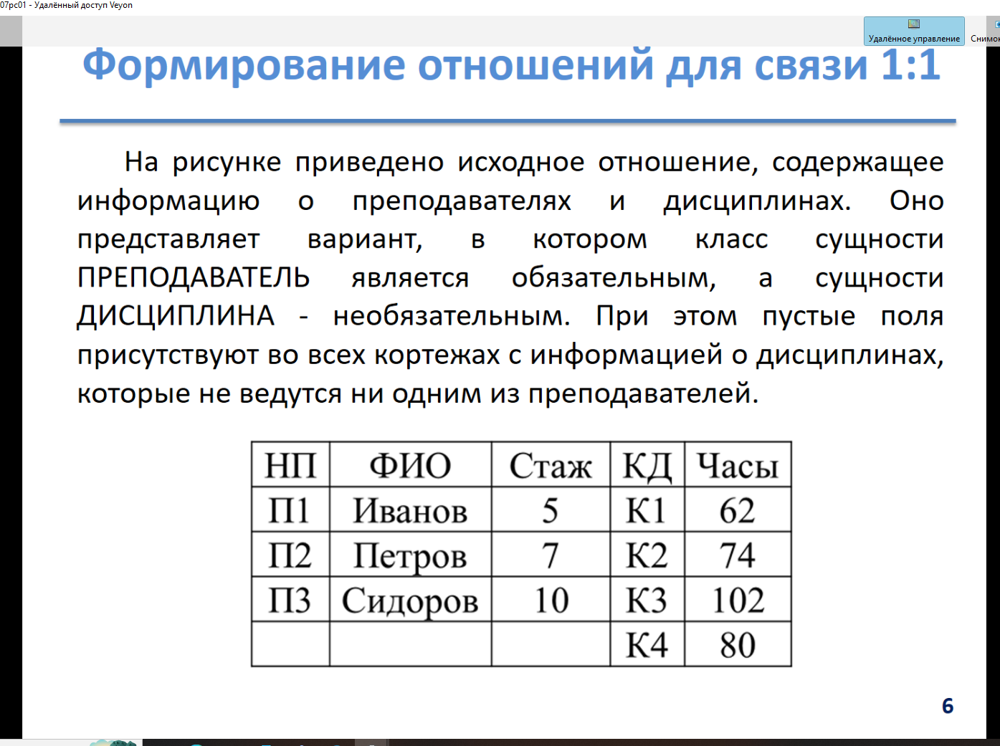
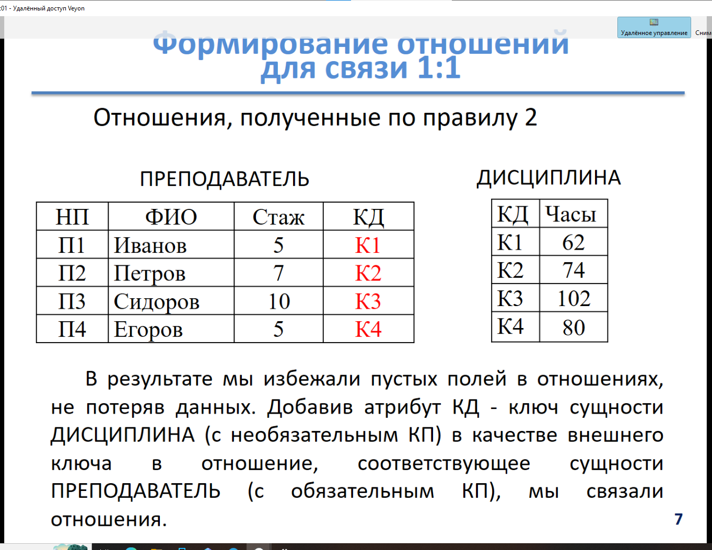
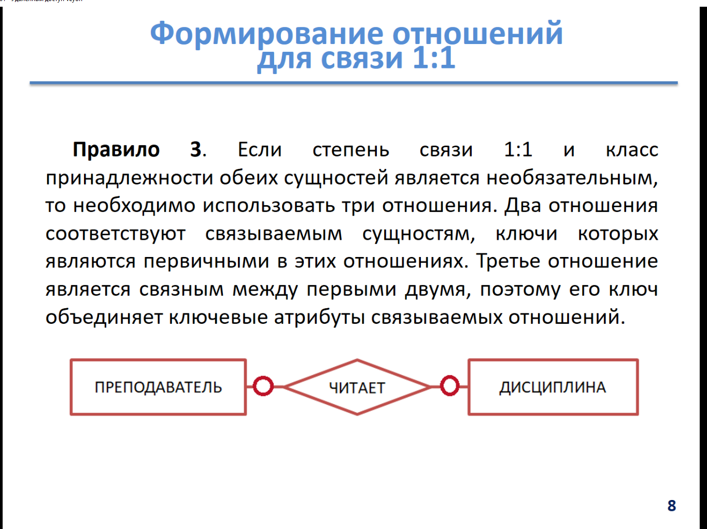
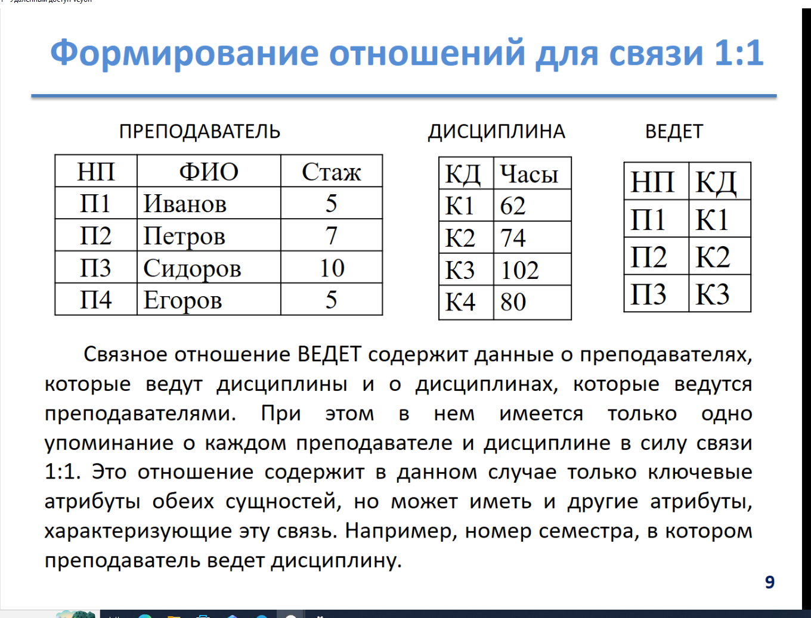

Будет хранится:
* Тип самомолета
* пункт отправления и пункт назначения
* дата вылета
* время вылета
* время палета
* цена билета
* Общее коллечество мест
* кол свободных мест
* фио пассажира 
* Серия и номер паспорта

Cущности:
* Рейс
* Характеристики самолета
* Пассажиры

# Правила Построения ER диаграм
## Формирование отношений 1:1
Правило 1:

Правило 2:

Отношения по правилу 2

Правило 3:

